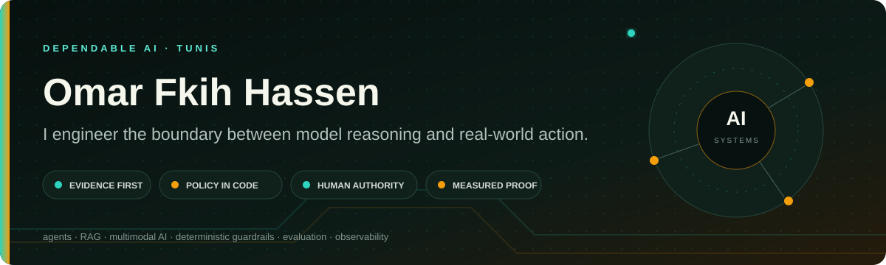
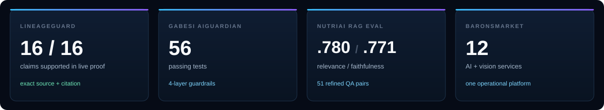
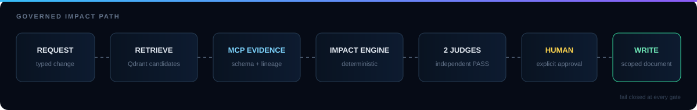
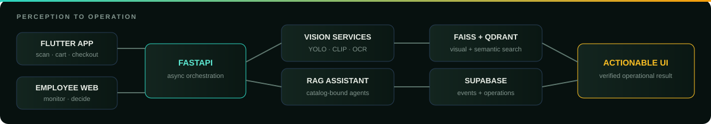
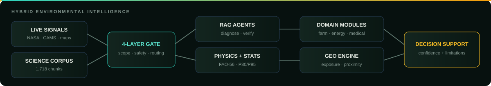
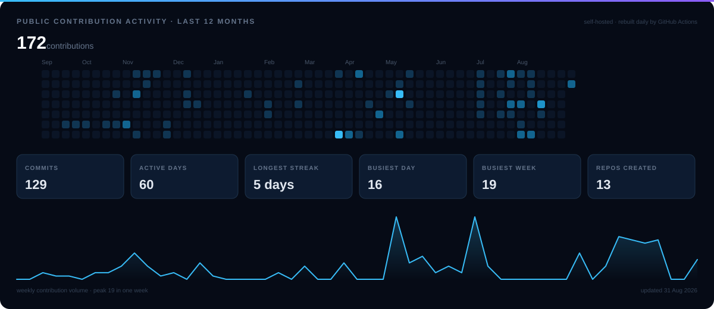

  
  
  
  

I build AI systems for problems where **a plausible answer is not enough** — governed data changes, retail operations, environmental risk, finance, nutrition, and accessibility.

The signature across my work is a closed engineering loop: **retrieve evidence → let specialized agents reason → enforce critical rules in code → keep a human at the authority boundary → observe and evaluate the result.** The model is one component inside a typed, testable system; it is never the whole system.

<table>
  <tr>
    <td align="center" width="16.6%"><a href="https://github.com/omarfh111/LineageGuard-AI"> <b>LineageGuard</b></a></td>
    <td align="center" width="16.6%"><a href="https://github.com/omarfh111/BaronsMarket"> <b>BaronsMarket</b></a></td>
    <td align="center" width="16.6%"><a href="https://github.com/omarfh111/Gabesi-AIGuardian"> <b>Gabesi</b></a></td>
    <td align="center" width="16.6%"><a href="https://github.com/omarfh111/FairTrace"> <b>FairTrace</b></a></td>
    <td align="center" width="16.6%"><a href="https://github.com/omarfh111/MarketLens"> <b>MarketLens</b></a></td>
    <td align="center" width="16.6%"><a href="https://github.com/omarfh111/NutriAI"> <b>NutriAI</b></a></td>
  </tr>
</table>

## Selected work

### [LineageGuard AI](https://github.com/omarfh111/LineageGuard-AI) &nbsp;·&nbsp; Governed agents for DataHub

An evidence-first agent system for schema-change impact analysis, verified catalog answers, and human-approved documentation write-back. Vector search can nominate a candidate; only live DataHub MCP reads can establish a fact. A deterministic engine computes blast radius and remediation, two independent judges review the immutable dossier, and the human owns the only write path.

| | |
|:--|:--|
| **Authority model** | Read-only by default; model agents cannot call the isolated writer |
| **Evidence** | Exact URNs, live schemas and multi-hop lineage from DataHub MCP |
| **Safety** | Double review, capability checks, idempotency, compare-and-swap and uncertain-outcome reconciliation |
| **Reproducibility** | Docker Compose, deterministic tests, browser E2E, CI and a public judge guide |

     

**[▶ Live demo](https://lineageguard.hackdev.tech)** &nbsp;·&nbsp; [Evidence dossier](https://github.com/omarfh111/LineageGuard-AI/blob/main/docs/live-writeback-proof.md) &nbsp;·&nbsp; [Testing guide](https://github.com/omarfh111/LineageGuard-AI/blob/main/docs/judge-testing.md) &nbsp;·&nbsp; [Repository](https://github.com/omarfh111/LineageGuard-AI)

 

### [BaronsMarket](https://github.com/omarfh111/BaronsMarket) &nbsp;·&nbsp; Multimodal AI for smart retail

A complete retail system: a Flutter shopping experience, an employee operations console, and a GPU-ready FastAPI backend orchestrating **12 AI and computer-vision services**. The platform connects perception to operations — product recognition, freshness, queues, theft events, document integrity, employee access, semantic search, checkout and analytics.

| | |
|:--|:--|
| **Perception** | YOLO, CLIP, OCR, liveness, face matching and PyTorch/CUDA inference |
| **Retrieval** | FAISS for visual similarity and Qdrant for catalog-grounded semantic search |
| **Agent design** | Router and specialist agents constrained to products in the real catalog |
| **Product surface** | Flutter mobile app, employee dashboard, async video jobs and store analytics |

     

[Demo evidence](https://github.com/omarfh111/BaronsMarket/tree/main/docs/screenshots) &nbsp;·&nbsp; [Architecture](https://github.com/omarfh111/BaronsMarket#architecture) &nbsp;·&nbsp; [Repository](https://github.com/omarfh111/BaronsMarket)

 

### [Gabesi AIGuardian](https://github.com/omarfh111/Gabesi-AIGuardian) &nbsp;·&nbsp; Environmental and emergency intelligence

A regional decision-support platform for Gabès, Tunisia. It joins scientific RAG, live NASA and atmospheric data, geospatial analysis, deterministic environmental models, community alerts, energy projections, and medical triage — without pretending every problem should be solved by an LLM.

| | |
|:--|:--|
| **Grounding** | 1,718 scientific chunks across 21 documents plus live external signals |
| **Determinism** | FAO-56 irrigation, P80/P95 pollution bands, Haversine proximity and zero-LLM orchestration where appropriate |
| **Safety** | Four-layer guardrails, faithfulness verification and confidence-gated medical routing |
| **Validation** | 56 passing tests; Top 8 at H12 Innovation 3.0 — AI Healing Gabès |

    

[Architecture](https://github.com/omarfh111/Gabesi-AIGuardian#2-system-overview) &nbsp;·&nbsp; [Design decisions](https://github.com/omarfh111/Gabesi-AIGuardian#design-decisions--tradeoffs) &nbsp;·&nbsp; [Repository](https://github.com/omarfh111/Gabesi-AIGuardian)

## How I build — the engineering signature

| Stage | What repeats across the projects |
|:--|:--|
| **1 · Observe** | PDFs, images, video, catalog metadata, satellite feeds, APIs and user context enter through explicit schemas. |
| **2 · Ground** | RAG narrows the search space; authoritative tools or datasets establish the evidence. Similarity is never treated as truth. |
| **3 · Orchestrate** | Specialized agents run in bounded sequential or fan-out/fan-in graphs, with structured outputs and explicit failure states. |
| **4 · Enforce** | Deterministic code owns thresholds, scoring, permissions, routing gates, idempotency and other load-bearing decisions. |
| **5 · Verify** | Tests, retrieval evaluations, traces, independent review and human approval close the loop. |

This is the common architecture behind the portfolio: **AI that can explain what it used, code that defines what it may do, and evidence that shows what actually happened.**

## More systems

| Project | Engineering evidence |
|:--|:--|
| [NutriAI](https://github.com/omarfh111/NutriAI) | Nutrition RAG over 18,601 dishes; 51 generated-and-refined QA pairs; 0.780 context relevance and 0.771 faithfulness |
| [MarketLens](https://github.com/omarfh111/MarketLens) | Product retrieval, campaign generation and a nine-agent retail analytics pipeline; Top 4 at Lunar Hack 2.0 |
| [TerraGuard](https://github.com/omarfh111/TerraGuard) | Nine-agent climate audit against GRI, TCFD, IFRS and IPCC evidence; 28/28 retrieval checks |
| [FairTrace](https://github.com/omarfh111/FairTrace) | Explainable credit decisions through parallel debate, dense + sparse retrieval and RRF |
| [Engineering Copilot](https://github.com/omarfh111/engineering-copilot-ai) | React, Spring Boot and FastAPI behind explicit trust boundaries, CI and human-reviewed AI findings |
| [DeepDrive](https://github.com/omarfh111/DeepDrive) | Automotive computer vision, specialized agents and full transaction workflows |

## Selected collaborations

These are shared builds whose canonical repository belongs to a teammate. They are listed separately to make ownership and collaboration explicit.

| Project | Contribution context | Proof and references |
|:--|:--|:--|
| **Splunk Sentinel** | Collaborator on an autonomous SOC investigation platform: six agents, ReAct reconstruction, Splunk-native evidence and 425 passing tests | [▶ Demo](https://youtu.be/vdQYQY1cXFA) · [Devpost](https://devpost.com/software/splunk-sentinel) · [Canonical repository](https://github.com/Asembris/splunk-sentinel) |
| **CareerPath Compass** | Collaborator on agentic career guidance grounded in O\*NET, BLS and Neo4j; 83.3% RAG grounded pass rate with a documented ablation | [▶ Live demo](https://careerpath-compass.vercel.app) · [Evidence](https://github.com/Asembris/CareerPathCompass#impact-metrics) · [Canonical repository](https://github.com/Asembris/CareerPathCompass) |
| **IBSAR** | Team Barons build for voice-first banking and shopping accessibility, created with the IBSAR association | [Project context](https://github.com/Asembris/EspritMaratech2026-Barons#-présentation-du-projet) · [Canonical repository](https://github.com/Asembris/EspritMaratech2026-Barons) |

## Activity

Self-hosted in this repository and refreshed daily by <a href=".github/workflows/profile-activity.yml">GitHub Actions</a>. No third-party statistics widget.

## Stack

| | |
|:--|:--|
| **Languages** |      |
| **Agents & LLM** |       |
| **Retrieval & ML** |       |
| **Backend & Data** |      |
| **Product & Delivery** |      |
| **Observability & Quality** |     |

## Background

- AI & Computer Engineering student at **ESPRIT**, Tunisia
- AI engineering internship experience at **Capgemini Engineering**
- Hackathon builder: **Lunar Hack 2.0 — Top 4**, **H12 Innovation 3.0 — Top 8**, **Vectors in Orbit — finalist**
- Interested in agent reliability, multimodal systems, RAG evaluation and human-controlled automation

  
  

