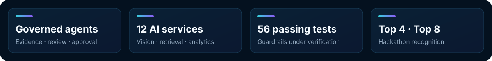

  
  
  

I build **AI systems that move beyond demos**: multi-agent workflows that retrieve evidence, call real tools, stream their progress, and keep humans in control of consequential actions.

My work spans data governance, computer vision, climate intelligence, retail, finance, and accessibility. Across those domains, the engineering pattern stays consistent: **ground model outputs in verifiable data, enforce critical rules in code, and make every decision observable.**

## Selected work

### [LineageGuard AI](https://github.com/omarfh111/LineageGuard-AI) · Governed DataHub agents

Evidence-first agents for schema-change impact analysis and verified catalog answers. Qdrant proposes relevant context, live DataHub MCP reads confirm facts, deterministic code computes risk, independent reviewers assess the dossier, and a human controls the only permitted write-back.

| | |
|:--|:--|
| **Safety** | Read-only by default; every mutation gate fails closed |
| **Verification** | Agentic RAG backed by exact DataHub assets, lineage and schema evidence |
| **Governance** | Independent review, explicit approval, idempotency and audit history |
| **Delivery** | Docker Compose, CI, deterministic tests, browser E2E and a public demo |

     

**[Live demo](https://lineageguard.hackdev.tech)** · [Repository](https://github.com/omarfh111/LineageGuard-AI)

 

### [BaronsMarket](https://github.com/omarfh111/BaronsMarket) · AI platform for smart retail

A full-stack retail platform combining a Flutter shopping assistant, an employee operations dashboard, and a GPU-ready FastAPI backend. Twelve AI and computer-vision services cover product retrieval, freshness, queue optimization, fraud detection, employee access, analytics, and a catalog-grounded shopping assistant.

| | |
|:--|:--|
| **Vision** | YOLO, CLIP, FAISS, OCR, face matching and PyTorch/CUDA inference |
| **Agents** | Multi-agent RAG constrained to products available in the real catalog |
| **Experience** | Flutter mobile app plus an operational employee dashboard |
| **Data** | Qdrant semantic search and Supabase persistence |

    

[Repository](https://github.com/omarfh111/BaronsMarket)

 

### [Gabesi AIGuardian](https://github.com/omarfh111/Gabesi-AIGuardian) · Environmental and emergency intelligence

A unified platform built for the people and oasis farmers of Gabès. It combines NASA satellite data, pollution monitoring, agriculture advice, geospatial community alerts, renewable-energy projections, and RAG-assisted medical triage in one operational system.

| | |
|:--|:--|
| **Scope** | Agriculture, pollution, emergency response, energy and medical triage |
| **Grounding** | Scientific knowledge bases, live APIs and geospatial evidence |
| **Reliability** | 56 passing tests and four-layer guardrails |
| **Recognition** | Top 8 at H12 Innovation 3.0 — AI Healing Gabès |

   

[Repository](https://github.com/omarfh111/Gabesi-AIGuardian)

 

### [MarketLens](https://github.com/omarfh111/MarketLens) · Multi-agent retail intelligence

One dashboard, three AI products: conversational inventory discovery, autonomous campaign generation, and a nine-agent analytics pipeline that turns weekly stock data into executive reports and recommendations.

| | |
|:--|:--|
| **Search** | CLIP embeddings and Qdrant semantic product retrieval |
| **Analytics** | Nine specialized agents, KPIs, charts and generated PDF reports |
| **Creative AI** | Campaign copy, trend-aware hashtags and product visuals |
| **Recognition** | Top 4 at Lunar Hack 2.0 |

   

[Repository](https://github.com/omarfh111/MarketLens)

## More projects

| Project | What it explores |
|:--|:--|
| [FairTrace](https://github.com/omarfh111/FairTrace) | Explainable credit decisions through multi-agent debate and hybrid retrieval |
| [NutriAI](https://github.com/omarfh111/NutriAI) | Vision-to-nutrition analysis grounded in 18,601 dishes, with persistent memory |
| [TerraGuard](https://github.com/omarfh111/TerraGuard) | Nine-agent climate-accountability auditing against GRI, TCFD, IFRS and IPCC evidence |
| [Engineering Copilot](https://github.com/omarfh111/engineering-copilot-ai) | Secure software-engineering knowledge platform built with React, Spring Boot and FastAPI |
| [DeepDrive](https://github.com/omarfh111/DeepDrive) | AI-assisted vehicle analysis, recommendations, payments and test-drive workflows |
| [IBSAR / Sanad](https://github.com/omarfh111/Sanad) | Voice-first banking and shopping for people with visual or mobility impairments |

## How I build

| Principle | In practice |
|:--|:--|
| **Evidence before confidence** | RAG narrows the search; authoritative systems and deterministic checks establish facts. |
| **Agents with boundaries** | Models propose and synthesize; policy code owns permissions and critical decisions. |
| **Observable workflows** | Structured outputs, streaming progress, traces, evaluations and audit logs. |
| **Full-stack delivery** | The model is only one component: I build the API, data layer, interface, tests and deployment path around it. |

## Stack

| | |
|:--|:--|
| **Languages** | Python · TypeScript · Java · SQL · C |
| **Agentic AI** | LangGraph · LangChain · CrewAI · MCP · OpenAI · Ollama |
| **AI & Data** | PyTorch · YOLO · CLIP · scikit-learn · Qdrant · FAISS · ChromaDB |
| **Backend** | FastAPI · Django · Spring Boot · PostgreSQL · Supabase |
| **Frontend** | React · Next.js · Vite · Tailwind CSS · Flutter |
| **Engineering** | Docker · GitHub Actions · LangSmith · SSE · REST APIs |

## Background

- AI & Computer Engineering student at **ESPRIT**, Tunisia
- Building applied AI systems across governance, sustainability, finance, retail and accessibility
- Hackathon finalist and builder: **Lunar Hack 2.0 (Top 4)**, **H12 Innovation 3.0 (Top 8)**, and **Vectors in Orbit (Top 12)**

  

